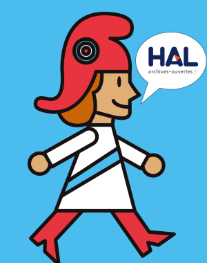
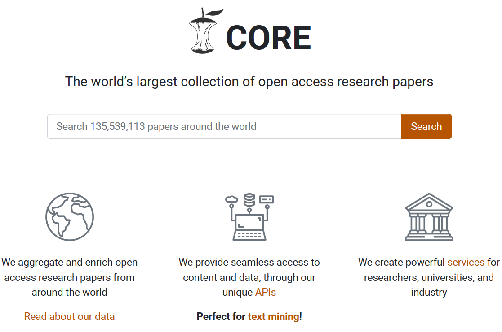

# Publier des articles en libre accès en chimie - Ecole doctorale n° 40 sciences chimiques

## Sommaire en image

## Sommaire

<!-- MDTOC maxdepth:3 firsth1:0 numbering:0 flatten:0 bullets:1 updateOnSave:1 -->

- [Sommaire en image](#sommaire-en-image)
- [Sommaire](#sommaire)
- [0. Tour de table](#0-tour-de-table)
- [1. Notions clés et modèles de libre accès](#1-notions-clés-et-modèles-de-libre-accès)
   - [Film "Privés de savoirs?" et addenda](#film-privés-de-savoirs-et-addenda)
      - [Addendum 1, la loi française](#addendum-1-la-loi-française)
      - [Addendum2, les versions d'un article](#addendum2-les-versions-dun-article)
      - [Addendum3, la notion d'accès](#addendum3-la-notion-daccès)
   - [Les modèles de libres accès en bref](#les-modèles-de-libres-accès-en-bref)
- [2. Focus sur les revues en libre accès](#2-focus-sur-les-revues-en-libre-accès)
   - [Enjeux économiques](#enjeux-économiques)
   - [Enjeux juridiques](#enjeux-juridiques)
      - [Effectivité de la mise en libre acccès](#effectivité-de-la-mise-en-libre-acccès)
      - [Types de licence](#types-de-licence)
   - [Enjeux éditoriaux](#enjeux-éditoriaux)
      - [Modèles éditoriaux](#modèles-éditoriaux)
      - [Comment s'y retrouver?](#comment-sy-retrouver)
- [3. Focus sur les archives ouvertes](#3-focus-sur-les-archives-ouvertes)
   - [Quelles différences entre une archive ouverte et ResearchGate?](#quelles-différences-entre-une-archive-ouverte-et-researchgate)
   - [Comment choisir une archive ouverte?](#comment-choisir-une-archive-ouverte)
      - [Couverture disciplinaire](#couverture-disciplinaire)
      - [Critère institutionnel](#critère-institutionnel)
      - [Type de contenu déposable](#type-de-contenu-déposable)
      - [Fonctionnalités spécifiques](#fonctionnalités-spécifiques)
- [4. TP1, politiques de libre accès des éditeurs](#4-tp1-politiques-de-libre-accès-des-éditeurs)
- [5. TP2, politiques de libre accès des organismes de financement de la recherche](#5-tp2-politiques-de-libre-accès-des-organismes-de-financement-de-la-recherche)
- [6. Conclusion](#6-conclusion)
   - [Quelle évolution pour le libre accès?](#quelle-évolution-pour-le-libre-accès)
   - [Mise en perspective, du libre accès à la science ouverte](#mise-en-perspective-du-libre-accès-à-la-science-ouverte)
   - [TP3, création de votre identifiant ORCID et dépôt d'un article dans une archive ouverte](#tp3-création-de-votre-identifiant-orcid-et-dépôt-dun-article-dans-une-archive-ouverte)
      - [ORCID?](#orcid)
      - [Dépôt dans le bac à sable de Zenodo](#dépôt-dans-le-bac-à-sable-de-zenodo)

<!-- /MDTOC -->

## 0. Tour de table

## 1. Notions clés et modèles de libre accès

### Film "Privés de savoirs?" et addenda

Poulain, H. (2016). Privés de savoir ? (Nᵒ 63). In _#DataGueule_. France Télévisions. https://www.youtube.com/watch?v=WnxqoP-c0ZE

#### Addendum 1, la loi française

Source : Magron, A. (2016, octobre 19). Vos dépôts dans HAL : ce qui change avec la loi pour une République Numérique. _CCSD_. https://www.ccsd.cnrs.fr/2016/10/vos-depots-dans-hal-ce-qui-change-avec-la-loi-pour-une-republique-numerique/

La loi pour une République numérique promulguée le 8 octobre 2016 comporte un article dédié au libre accès aux articles scientifiques, l’article 30.

En bref, tous les articles scientifiques issus de la recherche publique peuvent désormais être déposés dans une archive ouverte:

* dans leur **version "manuscrit accepté"**,
* avec un **embargo maximum de 6 mois** (sciences, techniques et médecine - STM)/12 mois (sciences humaines et sociales - SHS),

quelle que soit la politique de libre accès de l’éditeur.

  Lire [l'article 30 de la Loi sur Legifrance Legifrance](https://www.legifrance.gouv.fr/eli/loi/2016/10/7/ECFI1524250L/jo#JORFARTI000033202841)

 Consulter la [FAQ fournie par le consortium Couperin](https://openaccess.couperin.org/category/faq/)

#### Addendum2, les versions d'un article

La loi française comme les politiques de libre accès reposent sur la distinction de différentes versions d'un article, correspondant à différentes étapes du processus de publication, comme l'illustre la figure suivante.

Source : Marwick, B. (2017). Open Science in Archaeology. _Open Science Framework_. https://doi.org/10.17605/OSF.IO/3D6XX

Nous évoquerons les _preprints_ plus loin.

Pour l'instant nous nous concentrons sur l'AAM (_author accepted manuscript_, manuscrit accepté) et la VoR (_Version of Record_, PDF éditeur).

Le manuscrit accepté correspond au manuscrit auteur de la version définitive de l’article accepté pour publication, avec les modifications apportées par le comité de lecture, mais sans la mise en forme finale de l’éditeur ni les mentions de copyright.  Les **épreuves** ne sont pas considérées comme un manuscrit accepté.

Voici un exemple des différentes versions d'un même article.

Rosticher, C., Viana, B., Laurent, G., Le Griel, P., & Chanéac, C. (2015). Insight into CaMgSi 2 O 6 :Eu 2+ ,Mn 2+ ,Dy 3+ Nanoprobes : Influence of Chemical Composition and Crystallinity on Persistent Red Luminescence : Insight into CaMgSi 2 O 6 :Eu 2+ , Mn 2+ , Dy 3+ Nanoprobes. _European Journal of Inorganic Chemistry_, _2015_(22), 3681‑3687. https://doi.org/10.1002/ejic.201500257

* _VoR_  = _Version of Record_ =  PDF éditeur : sur le site de Wiley - https://doi.org/10.1002/ejic.201500257

* _AAM_ = _Author Accepted Manuscript_ = manuscrit accepté :  sur HAL - https://hal.sorbonne-universite.fr/hal-01281472

La page [Direct2AAM](https://openaccessbutton.org/direct2aam) donne des indications détaillées pour récupérer la version manuscrit accepté de vos articles sur les systèmes de soumission d’articles des éditeurs.

#### Addendum3, la notion d'accès

 Quizz 1

La notion de libre accès demeure fluide et fait l'objet de plusieurs définitions et approches.

L'un des textes fondateurs, l'initiative de Budapest, pose ainsi une définition très stricte.

> By "open access" to this literature, we mean its free availability on the public internet, permitting any users to read, download, copy, distribute, print, search, or link to the full texts of these articles, crawl them for indexing, pass them as data to software, or use them for any other lawful purpose, without financial, legal, or technical barriers other than those inseparable from gaining access to the internet itself. The only constraint on reproduction and distribution, and the only role for copyright in this domain, should be to give authors control over the integrity of their work and the right to be properly acknowledged and cited.

Source : Chan, L., Cuplinskas, D., Eisen, M., Friend, F., Genova, Y., Guédon, J.-C., Hagemann, M., Harnad, S., Johnson, R., Kupryte, R., Manna, M. L., Rév, I., Segbert, M., Souza, S. de, Suber, P., & Velterop, J. (2002, février 14). _Read the Budapest Open Access Initiative_. Budapest Open Access Initiative. https://www.budapestopenaccessinitiative.org/read

D'autres définitions plus souples ont également été proposées.

> In practice, the BOAI definition is roughly equivalent to the popular “CC-BY” Creative Commons license (Creative Commons, 2018). However, a number of other sources prefer a less strict definition, requiring only that OA “makes the research literature free to read online” (Willinsky, 2003), or that it is “digital, online, [and] free of charge.” (Matsubayashi et al., 2009). Others have suggested it is more valuable to think of OA as a spectrum (Chen & Olijhoek, 2016).

Source : Piwowar, H., Priem, J., Larivière, V., Alperin, J. P., Matthias, L., Norlander, B., Farley, A., West, J., & Haustein, S. (2018). The state of OA : A large-scale analysis of the prevalence and impact of Open Access articles. _PeerJ_, _6_, e4375. https://doi.org/10.7717/peerj.4375

Dans cet article, la définition de "libre accès" retenue est la possibilité de **lire gratuitement l'article en ligne, soit sur le site de l'éditeur, soit sur un autre site**.

### Les modèles de libres accès en bref

Avant, c'était simple.

***

Aujourd'hui, c'est plus compliqué.

Voici quelques éléments de terminologie et de classification, à partir de l'article suivant.

Piwowar, H., Priem, J., Larivière, V., Alperin, J. P., Matthias, L., Norlander, B., Farley, A., West, J., & Haustein, S. (2018). The state of OA : A large-scale analysis of the prevalence and impact of Open Access articles. _PeerJ_, _6_, e4375. https://doi.org/10.7717/peerj.4375

>**Gold OA**: articles are published in an “OA journal,” a journal in which all articles are open directly on the journal website. In practice, OA journals are most often defined by their inclusion in the Directory of Open Access Journals (DOAJ)

 Le modèle "diamant" ou "platine" est un sous-ensemble du modèle "doré" dans lequel les auteurs ne paient pas de frais de publication. On trouve davantage de revues "diamant" ou "platine" en SHS qu'en STM.

>**Green OA**: Green articles are published in a toll-access journal, but self-archived in an OA archive. These “OA archives” are either disciplinary repositories like ArXiv, or “institutional repositories (IRs) operated by universities, and the archived articles may be either the published versions, or electronic preprints.

>**Hybrid OA**: articles are published in a subscription journal but are immediately free to read under an open license, in exchange for an article processing charge (APC) paid by authors.

 Piwowar et al. retiennent une définition plus large de la catégorie "hybride", à laquelle ils intègrent les articles disponibles sous une licence ouverte sur le site de l'éditeur, sans les critères d'immédiateté ni de frais de publication.

> **Bronze**: Free to read on the publisher page, but without an clearly identifiable license.

>**Academic Social Networks (ASN)**: Articles are shared by authors using commercial online social networks like ResearchGate and Academia.edu.

 En gris sur le schéma ; on y reviendra dans le focus sur les archives ouvertes. Piwowar et al. ne le considèrent pas comme du libre accès et le classifient en _Closed access_.

>**“Black OA”**: Articles shared on illegal pirate sites, primarily Sci-Hub and LibGen.

  Piwowar et al. ne le considèrent pas comme du libre accès et le classifient en _Closed access_.

 Quizz 2

## 2. Focus sur les revues en libre accès

### Enjeux économiques

Les données proviennent du projet [Open APC](https://www.intact-project.org/openapc/), couvrent les années 2005-2018, pour 158 organismes de recherche.

| Valeur en €| Revues "Full Gold" | Revues hybrides |
| :--:| --:| --:|
|moyenne |1481  | 2490 |
|médiane | 1407 | 2443 |

 

>There is hence concern that hybrid APCs often reflect traditional publishers’ concern to maintain existing profit margins and market position rather than the true costs of publishing.

Source : Ross-Hellauer, T., Schmidt, B., & Kramer, B. (2018). Are Funder Open Access Platforms a Good Idea?: _SAGE Open_, _8_(4). https://doi.org/10.1177/2158244018816717

Les frais de publication dans les revues hybrides **s’ajoutent** aux frais d’abonnement payés par les organismes de recherche. La publication selon ce modèle est la moins avantageuse économiquement.

Les tarifs sont très variables, y compris pour les revues publiées par un même éditeur.

Comment évaluer le juste prix d'un article?

Exemple de la décomposition du coût d'un article effectué par _eLife_ en 2016, pour des APC de 2500$.

>  We have assumed a US$ to Sterling exchange rate of 1.30, so the fee of $2,500 will cover the marginal costs of £1,798 and also contribute a small amount towards our fixed costs, for the time being. This will also give us some protection against having to revise the publication fee as the exchange rate moves.

Source : Patterson, M., & McLennan, J. (2016, septembre 29). _Setting a fee for publication_. ELife. https://elifesciences.org/inside-elife/b6365b76/setting-a-fee-for-publication

Des modulations tarifaires au sein d'une même revue peuvent intervenir et s'expliquer par différentes raisons. La liste suivante n'est pas exhaustive.

* **Raisons institutionnelles** : les éditeurs proposent différents types de contrat aux organismes de recherche pour que les chercheurs qui leur sont affiliés bénéficient de tarifs réduits voire nuls d'APC.
* **Raisons éditoriales** : au lancement de la revue, pour encourager la soumission d'articles - voir par exemple [la revue _Nanoscale Advances_ publiée par la RSC](https://www.rsc.org/journals-books-databases/open-access/#oajournals), ou en fonction d'une sélection effectuée par les éditeurs - voir par exemple [le service _ACS Editors’ Choice_](https://helpfaqs.acs.org/2014/07/10/how-are-articles-selected-for-acs-editors-choice/)
.
* **Raisons techniques** : les revues de l'EGU (European Geosciences Union), éditées par Copernicus, prévoient des frais différents pour les soumissions au format Word et LaTeX - voir par exemple [les tarifs de la revue _Atmospheric Chemistry and Physics_ ](https://www.atmospheric-chemistry-and-physics.net/for_authors/article_processing_charges.html).
* **Raisons juridiques** : certains éditeurs prévoient une tarification différente en fonction du type de licence choisi : l'OSA (Optical Society of America) demande ainsi un supplément de 500$ pour la licence CC-BY - voir [les tarifs APC de l'OSA](https://www.osapublishing.org/submit/review/pub_charge.cfm#apcs).

### Enjeux juridiques

Deux points de vigilance s'imposent, s'agissant de l'effectivité de la mise en libre accès et de la licence choisie d'une part, du type de licence d'autre part.

#### Effectivité de la mise en libre acccès

Ce point de vigilance concerne davantage les revues hybrides que les revues entièrement en libre accès.

Les deux anecdotes suivantes concernent des revues hybrides.

Beynon, R. (2018). OK Molecular and Cellular Proteomics @molcellprot @ASBMB I’m calling you out publicly. I just tried to access one of my own papers, for which we paid for GOLD OA, and it is paywalled. Poor show. I hope you will refund any poor sap who paid for access. Please fix this immediately.pic.twitter.com/dGh9MYpYVS [Tweet]. _@astacus_. https://twitter.com/astacus/status/951020844251340800

Gadd, E. (2018). Dear @SpringerOpen ,We have just published a paper (https://bit.ly/2EZGyvL ) with you under a CC-BY licence, but when you click on the article’s Reprints & Permissions link it takes you to a page that says the article is under a CC-BY-NC-ND licence.  Please can you correct this?pic.twitter.com/rdWVsMWSoz [Tweet]. _@LizzieGadd_. https://twitter.com/LizzieGadd/status/986932905694949376

#### Types de licence

En plus des licences internationales telles que _Creative Commons_, les éditeurs peuvent proposer leurs licences propres de publication dites "open access", avec toutefois des droits de réutilisation restreints.

_Creatives Commons_ permet de combiner de différentes façons 4 options en 6 licences.

Source : Klute, B., & Muuß-Merholz, J. (2018). _« Choo-Choo-Choose your license! » Infographic on Creative Commons licences_. https://www.joeran.de/infographic-on-creative-commons-licences/

 Usage des licences _Creatives Commons_ spécifiquement dans le contexte de la publication scientifique.

ASAPbio. (2018). _Licensing diagram_. http://asapbio.org/licensing-faq/licensing-diagram-2018-10-04

Creative Commons UK. (2017). _Fact Sheet on Creative Commons and Open Science_. https://doi.org/10.5281/zenodo.841086

### Enjeux éditoriaux

#### Modèles éditoriaux

Certaines revues en libre accès appliquent un modèle éditorial traditionnel, seul le mode de financement de la revue étant modifié.

D'autres se caractérisent par des innovations éditoriales plus ou moins directement en lien avec leur caractère _open_. On retient ici 2 exemples suivants.

* **EGU** : "_two stage journals with public peer-review and interactive public discussion_" - voir [la page "Publications > Introduction & general terms" sur le site de l'EGU](https://www.egu.eu/publications/)
* **divers éditeurs** : les _megajournals_

Les _megajournals_ se caractérisent par :
* une couverture large en termes de **domaines scientifiques**,
* un nombre très important d'articles publiés,
* la publication en libre accès des articles,
* des critères d'acceptation fondés uniquement sur la rigueur technique ou scientifique, **_technical/scientific soundness_**

Nombre total d'articles publiés dans 11 megajournals (Plos One, Scientific Reports, Medicine, and others: BMC Research Notes, BMJ Open, AIP Advances, SpringerPlus, PeerJ, SAGE Open, F1000 Research et FEBS Open Bio). Inclut des prévisions de chiffres pour 2016.

Source : Pinfield, S. (2016, octobre 13). _Mega-journals : The future, a stepping stone to it or a leap into the abyss?_. Times Higher Education (THE). https://www.timeshighereducation.com/blog/mega-journals-future-stepping-stone-it-or-leap-abyss

 En savoir plus sur les _megajournals_

Fry, J., & Wakeling, S. (2019, janvier 11). Who are you writing for? The role of community membership on authors’ decisions to publish in open access mega-journals. _LSE Impact Blog_. http://blogs.lse.ac.uk/impactofsocialsciences/2019/01/11/who-are-you-writing-for-the-role-of-community-membership-on-authors-decisions-to-publish-in-open-access-mega-journals/

Mudditt, A. (2018, janvier 18). Countering the Über-Brands : The Case for the Megajournal. _The Scholarly Kitchen_. https://scholarlykitchen.sspnet.org/2018/01/18/countering-uber-brands-case-megajournal/

#### Comment s'y retrouver?

Le site [Think, check, submit](https://thinkchecksubmit.org/) propose sur la page [Check](https://thinkchecksubmit.org/check/) une liste de points de contrôle permettant de vérifier la fiabilité d'une revue.

Cette page mentionne notamment le [DOAJ -  Directory of open access journals](https://doaj.org/), qui recense des revues en libre accès répondant à un certain nombre de critères de qualité.

_L'université de Bordeaux contribue financièrement au maintien de ce site._

Enfin, le site [Quality Open Access Market](https://www.qoam.eu/) publie des cartes d'évaluation des revues.
A partir de leur expérience de publication, les auteurs peuvent contribuer à ces cartes en indiquant une note de 1 à 5 pour les items suivants :
> * The editor of the journal is responsive.
> * The peer review of the journal has added value.
> * I would recommend scholars to submit their work to this journal.
> * I would deem this journal good value for money.

## 3. Focus sur les archives ouvertes

### Quelles différences entre une archive ouverte et ResearchGate?

Source : Fortney, K., & Gonder, J. (2015, décembre 1). A social networking site is not an open access repository. _Office of Scholarly Communication - University of California_. http://osc.universityofcalifornia.edu/2015/12/a-social-networking-site-is-not-an-open-access-repository/

 Le contenu des archives ouvertes est indexé dans des moteurs de recherche comme Google ou Google Scholar, et également dans des moteurs de recherche spécialisés **académiques** comme [BASE - Bielefeld Academic Search Engine](https://www.base-search.net/) ou [CORE](https://core.ac.uk/) ; CORE est également disponible aussi sous forme d'applisignet.

***

***

Il est également utilisé par des services de recherche d'articles en libre accès comme [Unpaywall](https://unpaywall.org/), disponible sous forme d'applisignet et intégré à Zotero, Scopus, [Open Access Button](https://openaccessbutton.org/) - applisignet, permettant de créer une demande d'accès si une version en libre accès n'a pas pu être identifié, etc.

**Si le contenu de ResearchGate, etc. est indexé par Google et Google Scholar, il ne l'est pas par BASE, CORE ni Unpaywall.**

### Comment choisir une archive ouverte?

Plusieurs critères peuvent être pris en compte

#### Couverture disciplinaire

Certaines archives sont spécialisées pour un domaine ([PudMed Central](https://www.ncbi.nlm.nih.gov/pmc/) pour les sciences biomédicales par exemple), d'autres n'ont pas de limitation.

#### Critère institutionnel

Une archive institutionnelle, comme nom nom l'indique, accepte des soumissions seulement des membres de la ou des institutions qui l'administrent. A Bordeaux, l'archive Oskar est ainsi un projet desservant les universités de Bordeaux et Bordeaux Montaigne, Sciences Po Bordeaux, Bordeaux Sciences Agro et Bordeaux INP.

Des archives comme [Zenodo](https://zenodo.org/) ou [HAL](https://hal.archives-ouvertes.fr/) sont ouvertes à des soumissions sans condition d'affiliation.

#### Type de contenu déposable

Certaines archives acceptent une très large typologie de publications ([Consultation HAL > Par type de publication](https://hal.archives-ouvertes.fr/browse/doctype)), voire d'autres productions que des publications scientifiques. Dans Zenodo il est ainsi possible de déposer et de caractériser comme tel des jeux de données, les livrables d'un projet, etc.

D'autres archives acceptent une typologie de dépôt plus restrictive, voire des contributions d'un seul type : [ChemRixv](https://chemrxiv.org/) accepte seulement des _preprints_ et non d'autres versions d'articles.

Voir : Nguyen, T. M. (2019). Chemistry preprints pick up steam. _Chemical & Engineering News_, _97_(3). https://cen.acs.org/acs-news/publishing/Chemistry-preprints-pick-steam/97/i3

#### Fonctionnalités spécifiques

* Référencement de financement

HAL permet de saisir les financements liés à une publication sous forme textuelle ainsi que sous la forme d'un lien à un référentiel pour les projets **ANR** et **européens**.

 [Exemple de dépôt dans HAL avec financement ANR et H2020](https://hal.archives-ouvertes.fr/hal-01825133)

Zenodo aussi est connecté à un référentiel de projet européen.

* Page personnelle et liste personnelle de publications

HAL permet de créer une **page chercheur** multilingue, avec de nombreuses options de personnalisation, automatiquement mise à jour au fil des dépôts dans HAL.

 [Documentation HAL : Identifiant auteur IdHAL et CV](https://doc.archives-ouvertes.fr/identifiant-auteur-idhal-cv/)

 [Exemple de CV HAL d'un chercheur en chimie](https://cv.archives-ouvertes.fr/ftielens)

La **communauté** dans Zenodo peut être utilisée à cette fin, mais les options sont plus limitées. La communauté est plus adaptée pour rassembler par exemple les productions d'un projet, voir par exemple [la communauté Zenodo du projet H2020 MSCA-ITN Enable](https://zenodo.org/communities/enable-h2020).

Voir :   O’Donnell, D. P. (2018, mars 30). Daniel Paul O’Donnell : Using Zenodo as a personal repository. _Daniel Paul O’Donnell Blog_. http://people.uleth.ca/~daniel.odonnell/Blog/using-zenodo-as-a-personal-repository

Pour plus de détails concernant les fonctionnalités de profil chercheur en ligne : Flamerie, F. (2019, janvier 31). _How to build your online researcher profile ?_. Journées « Information scientifique & technique » - Ecole doctorale des sciences exactes et leurs applications, Pau. https://github.com/fflamerie/pau_ed_2019

* Autres

Zenodo permet notamment d'attribuer un **DOI** à ses dépôts et de **réserver** en avance ce DOI, de déposer d'un clic un dépôt **GitHub**, de **lier** les dépôts à d'autres productions et de qualifier précisément ces liens.

La fonctionnalité de **collection** dans HAL permet de créer de façon plus sophistiquée, automatisée et personnalisable que la communuaté dans Zenodo des sous-ensembles de dépôts pour un laboratoire ([collection HAL de l'ICMCB](https://hal.archives-ouvertes.fr/ICMCB)), une équipe de recherche ([collection HAL de l'équipe LCMCP-MATBIO](https://hal.sorbonne-universite.fr/LCMCP-MATBIO)), un labex ([collection HAL du labex MATISSE](https://hal.sorbonne-universite.fr/MATISSE)), etc.

La plupart des systèmes permettent d'alimenter dynamiquement une liste de publications sur un site web tiers - [exemple d'une page "Publications" sur le site du LCPO, alimentée automatiquement par HAL](http://www.lcpo.fr/publications-by-this-team/).

## 4. TP1, politiques de libre accès des éditeurs

## 5. TP2, politiques de libre accès des organismes de financement de la recherche

## 6. Conclusion

### Quelle évolution pour le libre accès?

S'agissant des politiques de libre accès des organismes de financement, des évolutions notables pourraient intervenir si toutes les mesure du **PlanS** sont implémentées dans les délais prévus (2021). L'ANR et l'Union Européenne sont signataires du PlanS ; le prochain programme de financement de l'Union Européenne, "Horizon Europe" commence en 2021.

> The revised Plan S maintains the fundamental principles
>
>  * No scholarly publication should be locked behind a paywall;
> *  Open Access should be immediate i.e., without embargoes;
> *  Full Open Access is implemented by the default use of a Creative Commons Attribution CC BY licence as per the Berlin Declaration;
> *  Funders commit to support Open Access publication fees at a reasonable level;
> * Funders will not support publication in hybrid (or mirror/sister) journals unless they are part of a transformative arrangement with a clearly defined endpoint.

Source : Science Europe. (2019). _Rationale for the Revisions Made to the Plan S Principles and Implementation Guidance_. Plan S. https://www.coalition-s.org/rationale-for-the-revisions/

 Voir ausssi : Science Europe. (2020). _Principles and Implementation_. Plan S. https://www.coalition-s.org/addendum-to-the-coalition-s-guidance-on-the-implementation-of-plan-s/principles-and-implementation/

Afin de permettre aux chercheurs qu'ils financent de publier immédiatement en libre accès des articles revus par les pairs à des coûts maîtrisés, certains organismes de financement ont développé leur propre plateforme de publication.

* [Wellcome Open Research](https://wellcomeopenresearch.org/) pour le Wellcome Trust
* [Gates Open Research](https://wellcomeopenresearch.org/) pour la fondation Bill & Melinda Gates

Voir : Ross-Hellauer, T., Schmidt, B., & Kramer, B. (2018). Are Funder Open Access Platforms a Good Idea?: _SAGE Open_, _8_(4). https://doi.org/10.1177/2158244018816717

L'Union Européenne devrait [relancer un appel d'offre pour se doter d'une telle plateforme](https://ec.europa.eu/info/news/ec-launch-new-tender-open-access-publishing-platform-2019-apr-24_en).

### Mise en perspective, du libre accès à la science ouverte

Le libre accès aux articles scientifiques s'inscrit plus largement dans le cadre :
* du libre accès à d'**autres types de publication** que les articles et à des articles non publiés (les _preprints_),
* de l'ouverture d'autres composantes de la production scientifique : les **données de recherche**, le code informatique, etc.,
* et au-delà de la **science ouverte**.

Source : Pontika, N., Knoth, P., Cancellieri, M., & Pearce, S. (2015). _Fostering Open Science to Research using a Taxonomy and an eLearning Portal_. iKnow: 15th International Conference on Knowledge Technologies and Data Driven Business, Graz, Austria. https://doi.org/10/gfv3r3

 [Consulter les taxonomies détaillées en ligne](https://www.fosteropenscience.eu/taxonomy/term/7)

L'accessibilité et la disponibilité n'épuisent pas la notion d'ouverture.

Source : Bezjak, S., Clyburne-Sherin, A., Conzett, P., Fernandes, P. L., Görögh, E., Helbig, K., Kramer, B., Labastida, I., Niemeyer, K., Psomopoulos, F., Ross-Hellauer, T., Schneider, R., Tennant, J., Verbakel, E., Brinken, H., & Heller, L. (2018). _Open Science Training Handbook_. FOSTER Plus Consortium. https://book.fosteropenscience.eu/

### TP3, création de votre identifiant ORCID et dépôt d'un article dans une archive ouverte

#### ORCID?

Les identifiants ORCID iDs existent depuis octobre 2012. Ils sont administrés par une organisation indépendante à but non lucratif, ORCID, financée par les souscriptions de ses membres (éditeurs, organismes de recherche, agences de financement, etc. - [consulter la liste complète des memebres d'ORCID](https://orcid.org/members)).

##### Objectifs
* Assurer une **identification unique, univoque, pérenne et ouverte** des chercheurs
* Permettre une utilisation informatique automatisée fiable - **_machine readability_**
* Lier et intégrer de manière fiables des données : lier un chercheur à ses publications, aux financements qu'ila reçus, à son organisme d'affiliation, etc.
* Dans le respect de la règlementation concernant les données personnelles et en assurant à l'usager un contrôle sur la **confidentialité** de ses données

##### Fonctionnement

Source : Paglione, L., Olson, E., Laurel, H., & Buys, M. (2017, octobre 27). _Enter Once | Reuse Often : What does this mean to research institutions?_. https://doi.org/10.23640/07243.5544460.v1

ORCID gère également l'**authentification** : vous pouvez par exemple vous connecter à Zenodo sans avoir à créer de compte supplémentaire grâce à votre identifiant ORCID. Vous pouvez également connecter votre compte institutionnel à votre compte ORCID, et utiliser ainsi vos identifiants institutionnels pour vous authentifier sur tous les services auxquels ORCID est connecté.

#### Dépôt dans le bac à sable de Zenodo

Le bac à sable de Zenodo est accessible à l'adresse suivante : https://sandbox.zenodo.org/

Il permet de tester toutes les fonctionnalités de Zenodo sans pour autant publier dans la base de production.

****

# Crédits

 Ce document est mis à disposition selon les termes de la <a rel="license" href="http://creativecommons.org/licenses/by-sa/3.0/fr/">Licence Creative Commons Attribution -  Partage dans les Mêmes Conditions 3.0 France</a>.

**Auteur**

Frédérique Flamerie

 [orcid.org/0000-0001-6014-0134](https://orcid.org/0000-0001-6014-0134)

**Icônes**

Bezjak, S., Clyburne-Sherin, A., Conzett, P., Fernandes, P. L., Görögh, E., Helbig, K., Kramer, B., Labastida, I., Niemeyer, K., Psomopoulos, F., Ross-Hellauer, T., Schneider, R., Tennant, J., Verbakel, E., Brinken, H., & Heller, L. (2018). _Open Science Training Handbook_. FOSTER Plus Consortium. https://book.fosteropenscience.eu/
 [CC-Zero]
