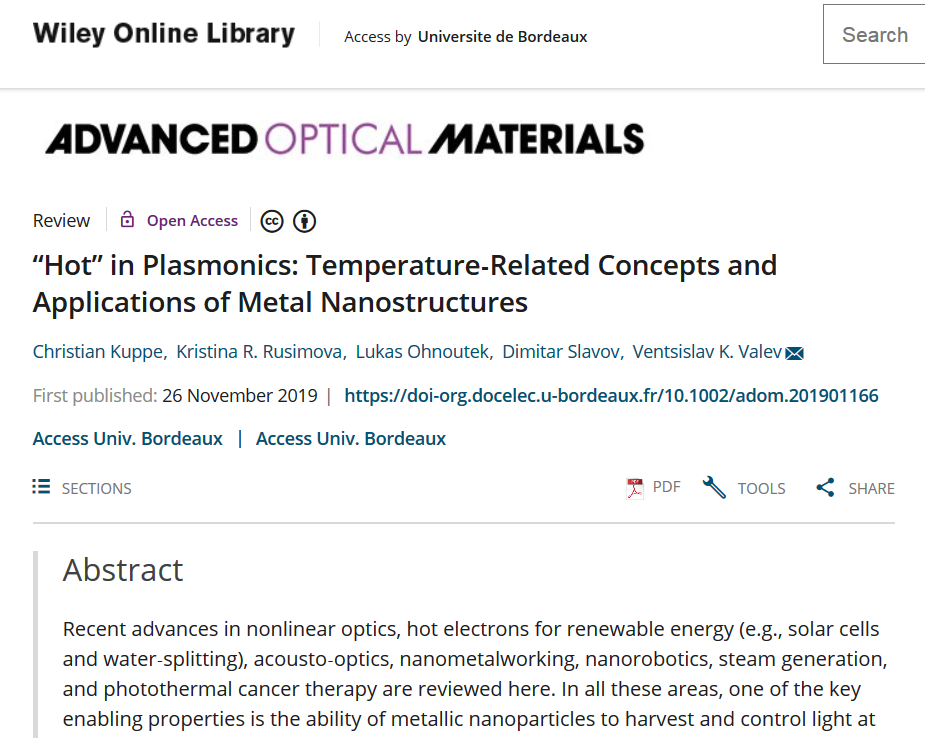
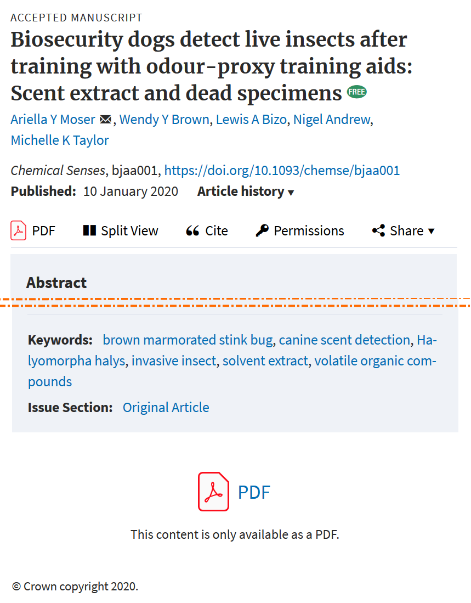

# "Publier des articles en libre accès en chimie" - ED n° 40 Sciences chimiques - 2020-01-31 - Quizz et TP

## Quizz 1

_Les réponses exactes sont en gras_

### Cet article est-il en libre accès? 1/2

* **Oui**
* Non

Référence article :

Kuppe, C., Rusimova, K. R., Ohnoutek, L., Slavov, D., & Valev, V. K. (2020). “Hot” in Plasmonics : Temperature-Related Concepts and Applications of Metal Nanostructures. _Advanced Optical Materials_, _8_(1), 1901166. https://doi.org/10.1002/adom.201901166

### Cet article est-il en libre accès? 2/2

* **Oui**
* **Non**

Référence article :

Moser, A. Y., Brown, W. Y., Bizo, L. A., Andrew, N., & Taylor, M. K. (2020). Biosecurity dogs detect live insects after training with odour-proxy training aids : Scent extract and dead specimens. _Chemical Senses_. https://doi.org/10.1093/chemse/bjaa001

**Oui** si on définit le libre accès comme la possibilité de lire gratuitement un article en ligne, **Non** si on définit le libre accès comme la possibilité de réutiliser l'article.

## Quizz 2

_Les réponses exactes sont en gras_

### A votre avis, **toutes disciplines confondues**, quelle part des articles de revue publiés **en 2017** sont-ils disponibles en libre accès?

* moins de 25%
* environ 30%
* **environ 40%**
* plus de 50%
* plus de 75%

Source : European Commission. (s. d.). _Trends for open access to publications_. European Commission. Consulté 15 janvier 2020, à l’adresse https://ec.europa.eu/info/research-and-innovation/strategy/goals-research-and-innovation-policy/open-science/open-science-monitor/trends-open-access-publications_en

Ces indicateurs reposent sur la catégorisation des modes de libre accès en _green_, _gold_, _bronze_ et _hybrid_.

### A votre avis, si considère seulement la **chimie**, quelle part des articles de revue publiés **en 2017** sont-ils disponibles en libre accès?

* **moins de 25**%
* environ 30%
* environ 40%
* plus de 50%
* plus de 75%

Source : European Commission. (s. d.). _Trends for open access to publications_. European Commission. Consulté 15 janvier 2020, à l’adresse https://ec.europa.eu/info/research-and-innovation/strategy/goals-research-and-innovation-policy/open-science/open-science-monitor/trends-open-access-publications_en

Ces indicateurs reposent sur la catégorisation des modes de libre accès en _green_, _gold_, _bronze_ et _hybrid_.

### A votre avis, **en euros**, combien faut-il payer pour publier un article dans _Nature Communications_?

Le tableau Excel des tarifs de Nature est disponible à l'adresse suivante : http://www.nature.com.docelec.u-bordeaux.fr/openresearch/publishing-with-npg/nature-journals/ ; pour 2020 le tarif public est de **4380 euros**. La politique de remises tarifaires est détaillée sur la page suivante : https://www.springernature.com/gp/open-research/policies/journal-policies , rubrique "Article processing charges". Les types de remise suivantes sont applicables.

> * APC waivers for financial need
> * APC waivers for substantial critiques of articles published in OA journals
> * APC waivers and refunds for publisher errors

### A votre avis, pour l'année **2017**, quel est le montant total **en euros** des frais de publication dans **PloSOne** payés par l'université de Bordeaux?

Le montant total s'élève à un peu plus de **23 000** euros pour **18 articles** ; c'est la revue en libre accès pour laquelle l'université a payé le montant total le plus élevé.

Les données détaillées sont disponibles sur le site du projet OpenAPC :

https://treemaps.intact-project.org/apcdata/openapc/#institution/Universit%C3%A9%20de%20Bordeaux/country=FRA

## TP1, politiques de libre accès des éditeurs

Pour ce TP, vous travaillez en groupe.

On définit 4 groupes, pour couvrir les 4 éditeurs Wiley, Elsevier, ACS et RSC.

Dans le temps imparti, chaque groupe doit compléter les différentes rubriques de la fiche fournie.

## TP2, politiques de libre accès des organismes de financement de la recherche

Pour ce TP, vous travaillez en groupe.

On définit 2 groupes, pour couvrir 2 organismes de financement, l'ANR et l'Union Européenne.

Dans le temps imparti, chaque groupe doit compléter les différentes rubriques de la fiche fournie.

## TP3, création de votre identifiant ORCID et dépôt d'un article dans une archive ouverte
* Créez votre identifiant ORCID.
* Liez votre compte ORCID à votre compte institutionnel de l'université de Bordeaux.
* Si applicable, ajoutez des publications à votre profil.

* Connectez-vous à Zenodo sandbox en utilisant votre compte ORCID.
* Déposez une publication dont vous êtes coauteur ou un article dont un membre de votre laboratoire est coauteur.
